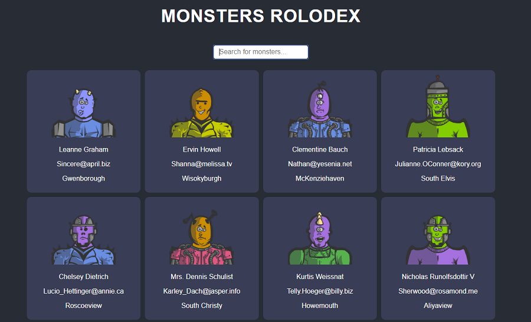

# Monsters Rolodex App in React

Monsters Rolodex App it is a create react app. It was created for desktop and mobile views. It displaying monsters
fetched from outer API ("https://jsonplaceholder.typicode.com/users"). It also has search funcionality. Pictures are
taken from "https://robohash.org/1?set=set2&size=180x180"

## Tools & Technology used

- Visual Studio Code
- React
- HTML
- CSS
- fetch
- Grid
